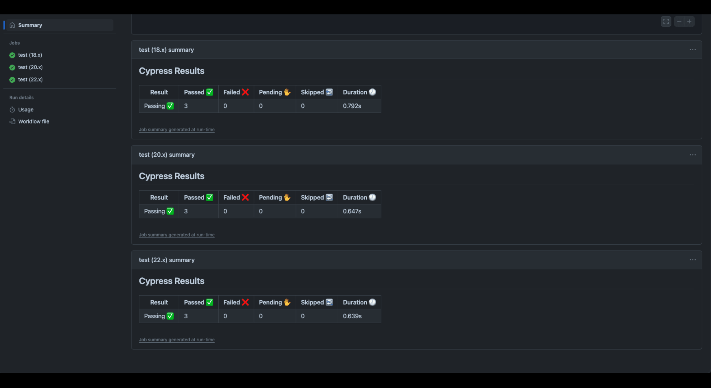

# GitHubActions

## Description

This is an example of a CI/CD pipeline using GitHub Actions to run the component tests via Cypress when a Pull Request is made to the develop branch, and the application is deployed when code is merged from develop to the main branch.

## Table of Contents (Optional)

- [Installation](#installation)
- [Usage](#usage)
- [License](#license)
- [How To Contribute](#howtocontribute)

## Installation
Download Repo from Github: [https://github.com/mollyhoward319/GitHubActions] 
In terminal, type git clone "https://github.com/mollyhoward319/GitHubActions.git"

## Usage

Your GitHub Actions for tests should look similar to the image below:


```md
    
```

Your GitHub Actions for deployments should look similar to the image below:

```md
    
```


You will want to have two separate YAML files: one configured to execute GitHub Actions for tests when a Pull Request is made to the develop branch and the other configured to execute GitHub Actions to automatically deploy to Render when develop is merged to main branch.
 
 [Deployed App on Render:](https://githubactions-mfou.onrender.com)]

## License

MIT License

Copyright (c) [2024] [Molly Howard]

Permission is hereby granted, free of charge, to any person obtaining a copy of this software and associated documentation files (the "Software"), to deal in the Software without restriction, including without limitation the rights to use, copy, modify, merge, publish, distribute, sublicense, and/or sell copies of the Software, and to permit persons to whom the Software is furnished to do so, subject to the following conditions:

The above copyright notice and this permission notice shall be included in all copies or substantial portions of the Software.

THE SOFTWARE IS PROVIDED "AS IS", WITHOUT WARRANTY OF ANY KIND, EXPRESS OR IMPLIED, INCLUDING BUT NOT LIMITED TO THE WARRANTIES OF MERCHANTABILITY, FITNESS FOR A PARTICULAR PURPOSE AND NONINFRINGEMENT. IN NO EVENT SHALL THE AUTHORS OR COPYRIGHT HOLDERS BE LIABLE FOR ANY CLAIM, DAMAGES OR OTHER LIABILITY, WHETHER IN AN ACTION OF CONTRACT, TORT OR OTHERWISE, ARISING FROM, OUT OF OR IN CONNECTION WITH THE SOFTWARE OR THE USE OR OTHER DEALINGS IN THE SOFTWARE.


## How to Contribute
To contribute to this repo, download the code or git clone the repo: [https://github.com/mollyhoward319/GitHubActions]. Then, create a new branch by typing "git checkout -b 'branch name'" in your terminal. From there, you can make edits and submit a pull request to provide your edits and/or feedback.

You can also fork this repo as desired with credit and questions sent to Molly Howard: mollyhoward.developer@gmail.com [https://github.com/mollyhoward319/]
